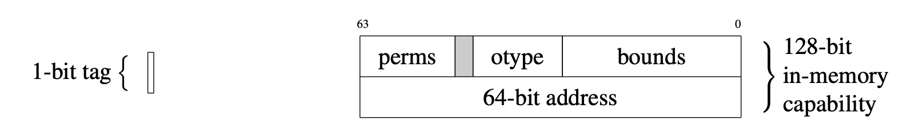

# CHERI capabilities

<!--
\begin{figure}[b]
\hspace{2.5cm}
% Tag
\begin{subfigure}[t!]{0.1\textwidth}
\begin{bytefield}[bitwidth=3pt]{1}
% \bitheader[endianness=big]{~,~} \\
\begin{leftwordgroup}{1-bit tag}
\bitbox{1}{}
\end{leftwordgroup}
\end{bytefield}
\end{subfigure}
% Capability
\begin{subfigure}[t!]{0.1\textwidth}
\begin{bytefield}[bitwidth=3pt]{64}
\bitheader[endianness=big]{0,63} \\
\begin{rightwordgroup}{128-bit \\ in-memory \\ capability}
\bitbox{16}{perms} & \bitbox{3}{\color{lightgray}\rule{\width}{\height}} & \bitbox{15}{otype} & \bitbox{30}{bounds} \\
\bitbox[lrb]{64}{64-bit~address}
\end{rightwordgroup}
\end{bytefield}
\end{subfigure}
\caption{128-bit CHERI Concentrate capability representation used in
  64-bit CHERI-MIPS and 64-bit CHERI-RISC-V: 64-bit address
  and metadata in addressable memory; and 1-bit out-of-band tag.}
\label{figure:cheri-capability-representation}
\end{figure}
-->

CHERI capabilities are twice the width of the native integer pointer type of
the baseline architecture: there are 128-bit capabilities on 64-bit platforms,
and 64-bit capabilities on 32-bit platforms.
Each capability consists of an integer (virtual) address of the natural size for
the architecture (e.g., 32 or 64 bit), and also additional metadata that is
compressed in order to fit in the remaining 32 or 64 bits of the capability
(see Figure 1 for an example; details
vary across underlying architectures and word sizes).
In addition, they are associated with a 1-bit validity "tag" whose value is
maintained in registers and memory by the architecture, but not part of
addressable memory.

*Figure 1: 128-bit CHERI Concentrate capability representation used in 64-bit CHERI-MIPS and 64-bit CHERI-RISC-V: 64-bit address and metadata in addressable memory; and 1-bit out-of-band tag.*

Each element of the additional metadata and tag of the capability contributes
to the protection model:

* **Validity tag**: The tag tracks the validity of a capability.
  If invalid, the capability cannot be used for load, store, instruction
  fetch, or other operations.
  It is still possible to extract fields from an invalid capability,
  including its address.

* **Bounds**: The lower and upper bounds are addresses restricting the
  portion of the address space within which the capability can be used for
  load, store, and instruction fetch.
  Setting a capability's address (i.e., where it points) within
  bounds will retain the capability's validity tag.  Setting addresses out of
  bounds is subject to the precision limits of the bounds compression model
  (see below and [Out-of-bounds pointers](../impact/out-of-bounds-pointers.html)); broadly speaking, setting addresses "near"
  the capability's bounds will preserve the validity tag.  (These out-of-bounds
  capabilities continue to authorize access only to memory within bounds.)

* **Permissions**: The permissions mask controls how the capability can be
  used &mdash; for example, by authorizing the loading and storing of data and/or
  capabilities.

* **Object type**: If this value is not equal to the unsealed object type, the capability is "sealed" and
  cannot be modified or dereferenced, but can be used to implement opaque
  pointer types.
  This feature is not described further in this document, as it is primarily
  used to implement software compartmentalization rather than object-level
  memory protection.

When stored in memory, valid capabilities must be naturally aligned &mdash; i.e.,
at 64-bit or 128-bit boundaries, depending on capability size &mdash; as that is
the granularity at which in-memory tags are maintained.
Partial or complete overwrites with data, rather than a complete overwrite
with a valid capability, lead to the in-memory tag being cleared, preventing
corrupted capabilities from later being dereferenced.

In order to reduce the memory footprint of capabilities, capability
compression is used to reduce the overhead of bounds so that the full
capability, including address, permissions, and bounds fits within 64 or
128 bits (plus the 1-bit out-of-band tag).
Bounds compression takes advantage of redundancy between the address
and the bounds, which occurs because a pointer typically falls within (or
close to) its associated allocation, and because allocations are typically
well aligned.
The compression scheme uses a floating-point representation, allowing high-precision bounds for small
objects, but requiring stronger alignment and padding for larger allocations
(see [Bounds alignment due to compression](../apis/bounds-alignment-due-to-compression.html)).
